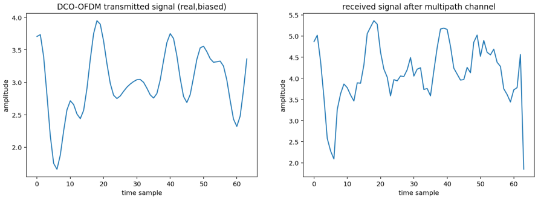
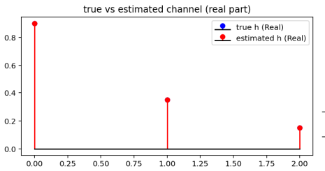
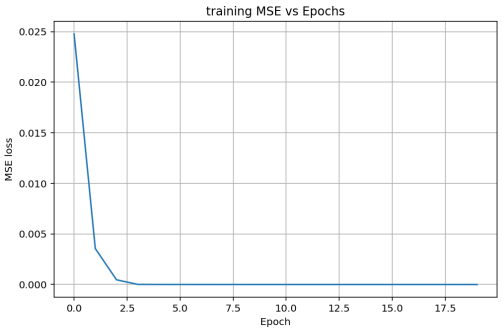

# Neural Network Based Channel Estimation for DCO-OFDM

# Project Overview
This project presents a neural network based approach for channel estimation in DC-biased Optical Orthogonal Frequency Division Multiplexing (DCO-OFDM) systems, commonly used in Visible Light Communication (VLC). Conventional channel estimation techniques such as Least Squares (LS) and Minimum Mean Square Error (MMSE) suffer performance degradation due to LED non-linearity, noise, and multipath effects. To address these challenges, a deep learning model is trained using pilot symbols to accurately estimate the optical channel response.

---

# Objectives
- To model a DCO-OFDM based optical communication system
- To study channel estimation challenges in VLC systems
- To design and train a neural network for channel estimation
- To evaluate the effectiveness of the neural network estimator

---

# System Block Diagram


The block diagram illustrates the complete DCO-OFDM transmission chain along with the neural network based channel estimation process.

---

# Methodology
1. Random pilot data generation
2. QPSK modulation
3. OFDM modulation with Hermitian symmetry
4. DC bias addition to generate DCO-OFDM signals
5. Multipath optical channel modeling with AWGN
6. Neural network training using pilot samples
7. Channel estimation and performance evaluation

---

# Neural Network Architecture
The neural network consists of fully connected dense layers with ReLU activation functions. The model is trained using Mean Squared Error (MSE) loss and the Adam optimizer. Pilot-based transmitted and received samples are used as inputs to estimate the multipath channel impulse response.

---

# Results

### DCO-OFDM Transmitted and Received Signal


### Channel Estimation Comparison


### Training Loss Convergence


The results demonstrate accurate channel estimation and fast convergence of the neural network, validating its effectiveness for DCO-OFDM systems.

---

## Project Structure

---

Neural-Network-based-channel-estimation-for-DCO-OFDM/
├── src/
│ ├── main.py
│ ├── ofdm_utils.py
│ ├── channel.py
│ └── nn_model.py
│
├── docs/
│ └── block_diagram.png
│
├── results/
│ ├── dco_ofdm_transmitted_vs_received.png
│ ├── channel_estimation_comparison.png
│ └── training_loss_convergence.png
│
├── requirements.txt
├── LICENSE
└── README.md
---

# How to Run the Project

   ```bash
   git clone https://github.com/your-username/Neural-Network-based-channel-estimation-for-DCO-OFDM.git
   pip install -r requirements.txt
   python src/main.py


